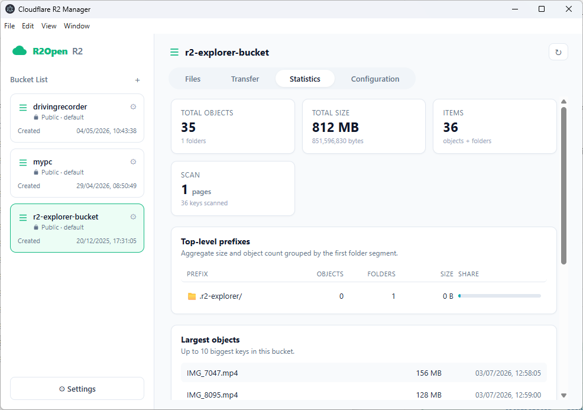
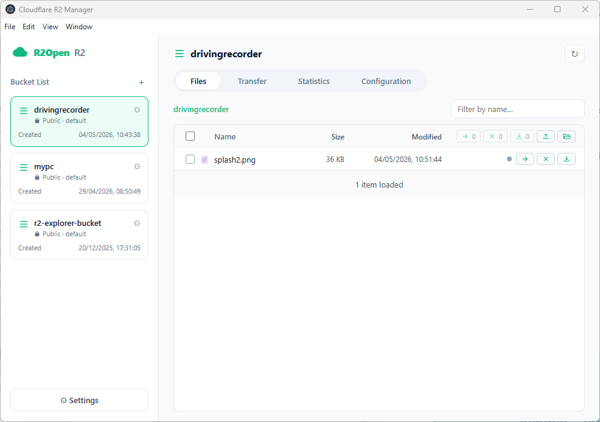

# R2Open

Cloudflare R2 Storage Manager - Desktop Client

## Features

- **Bucket Management**: Create, delete, and browse storage buckets
- **File Management**: Upload, download, delete, and move files/folders
- **Batch Operations**: Batch upload, download, and delete support
- **Transfer History**: Records all transfer operations, click filename to open local folder
- **Local Mapping**: Configure local sync folder for each bucket
- **Preview**: Support image and text file preview
- **Dark Mode**: Auto-follows system theme

## Tech Stack

- **Electron** - Desktop application framework
- **@aws-sdk/client-s3** - AWS S3 compatible API (for R2)
- **better-sqlite3** - Transfer history local storage
- **esbuild** - JavaScript build tool

## Project Structure

```
R2Open/
├── main.js              # Electron main process
├── preload.js           # Preload script (security bridge)
├── index.html           # Main page
├── css/
│   ├── styles.css       # Main styles
│   └── transfer.css     # Transfer history styles
├── js/
│   ├── core.js          # Core initialization
│   ├── components.js    # UI component rendering
│   ├── init.js          # Application initialization
│   ├── nav.js           # Navigation bar
│   ├── buckets.js       # Bucket management
│   ├── files.js         # File list and operations
│   ├── upload.js        # Upload functionality
│   ├── moving.js        # Move/rename functionality
│   ├── stats.js         # Bucket statistics
│   ├── transfer.js      # Transfer history
│   ├── settings.js      # Settings panel
│   ├── configuration.js # Bucket local configuration
│   └── storage.js       # Local storage
├── components/          # HTML templates
│   ├── sidebar.html
│   ├── main-view.html
│   ├── settings-modal.html
│   ├── moving-modal.html
│   └── new-bucket-modal.html
└── package.json
```

## Screenshots





## Configuration

### R2 Credentials

Click the "Setting" button on the side to configure:

- **Account ID**: Cloudflare account ID
- **Access Key ID**: R2 API token access key
- **Secret Access Key**: R2 API token secret key
- **Public Domain**: R2 public domain (e.g., `https://xxx.r2.dev`)

### Local Folder Mapping

Each bucket can have a local sync folder configured:

1. Click the "Configure" button on the bucket list
2. Select the local folder path
3. After configuration, you can see local sync status in file list (● indicates local exists)
4. Filenames in transfer history support click to open local folder

## Downloads

- [Windows Installer (v0.2.3)](dist/R2Open_0.2.3_x64-setup.exe)

## Development

```bash
# Install dependencies
npm install

# Start development mode
npm start

# Build Windows installer
npm run dist
```

## Keyboard Shortcuts

| Action | Description |
|--------|-------------|
| Click folder | Enter folder |
| Click filename | Preview file |
| Click filename (Transfer History) | Open local folder |
| Check checkbox | Select file |
| ➔ button | Move/rename |
| ✕ button | Delete |
| ↓ button | Download |

## Version

v0.2.3
